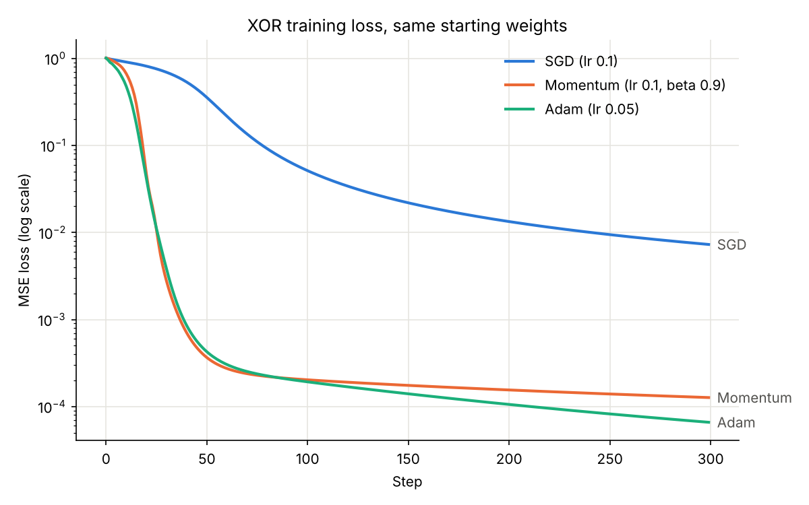

# Autograd

A scalar autograd engine written from scratch in plain Python, with a numerical
gradient checker, a small neural network library and SGD, Momentum and Adam
optimizers. The end result trains a 2-4-4-1 network on XOR with each optimizer
and compares the loss curves.

Every number in a computation is a `Value`. A `Value` holds a float, a `.grad`,
the values it was computed from, and a small `_backward` function that knows the
local derivative of the operation that made it. Calling `backward()` on the
final value walks that graph in reverse and fills in `.grad` everywhere.

## How the files depend on each other

```
train.py      builds a model, picks an optimizer, runs the training loop
optim.py      SGD, Momentum, Adam: read .grad, update .data
nn.py         Neuron, Layer, MLP and mse_loss, built out of Values
engine.py     Value: one number plus the graph it came from
gradcheck.py  compares engine.py's gradients against finite differences
```

Imports only point down the list. `engine.py` knows nothing about networks, and
`optim.py` imports nothing from the project at all: an optimizer gets a list of
objects with `.data` and `.grad` and that is all it touches. This is the same
split PyTorch uses (`torch.autograd`, `torch.nn`, `torch.optim`), and it means
each layer can be tested on its own. When training goes wrong, the gradient
check says whether the gradients are right, and the optimizer tests on `x**2`
say whether the updates are right.

## Running the tests

From this folder:

```bash
pip install pytest matplotlib
python -m pytest
```

There are 46 tests and they finish in under a second.

## Training on XOR

```bash
python train.py
```

This takes a couple of seconds. It prints the final loss and the four predictions
for each optimizer, then writes `loss_curves.png`.

The data is the four XOR points `[0,0] [0,1] [1,0] [1,1]` with targets
`-1 1 1 -1`. Each optimizer gets its own `MLP(2, [4, 4, 1])`, which has 37
parameters. The script calls `random.seed(0)` before building each model, so all
three start from exactly the same weights and the comparison is between
optimizers, not between lucky and unlucky starting points. Each run is 300
steps, and every step does `zero_grad()`, then `backward()`, then `step()`.



| Optimizer | Settings | Loss after 300 steps |
|---|---|---|
| SGD | lr 0.1 | 0.0073 |
| Momentum | lr 0.1, beta 0.9 | 0.00013 |
| Adam | lr 0.05 | 0.000066 |

All three get the sign right on every XOR point. SGD ends at -0.956, +0.916,
+0.904 and -0.896. Momentum and Adam both end within 0.015 of every target.

SGD is slow at the start: its loss is still 0.36 at step 50. Momentum and Adam
fall below 1e-3 by steps 37 and 39.

One seed is a small sample, so I also ran seeds 0 through 9. All three
optimizers solved XOR on all ten. SGD's final loss ranged from 0.0026 to 0.011,
Momentum's from 0.0000064 to 0.00022, and Adam's from 0.000066 to 0.0013. Seed 0
happens to favor Adam. Momentum ended lower than Adam on the other nine seeds,
so with these learning rates the gap between those two says more about tuning
than about which method is better.

## Design decisions

Each `Value` holds a single number instead of a matrix. Every operation's
derivative is then one line of calculus and the whole chain rule is visible.
The cost is speed: every intermediate result is a Python object, so this could
never train on something like MNIST. Tensors would also bring broadcasting and
matrix-multiply gradients, which are a second project.

Backpropagation is reverse mode. Training has one output (the loss) and many
inputs (the weights), and one backward pass gives the gradient for all 37
weights at once. Forward mode would need one pass per weight.

Each operation stores its derivative in a `_backward` closure next to the
forward code, so adding an operation touches one place. The downside is that
the graph is harder to inspect, since a node does not record which operation
made it.

Gradients are added with `+=`, never assigned. In `y = x * x`, `x` gets gradient
from both sides of the multiply, and `=` would keep only the second one. The
tests in `test_engine.py` cover a value used twice in one operation and a value
feeding two separate branches. The price is that gradients pile up across
backward passes, so they have to be zeroed before every one.

`backward()` sorts the graph topologically with a depth-first search before
running any `_backward`. A node can only pass gradient on once it has received
all of its own, and the reversed topological order guarantees that.

Subtraction, negation and division are built from addition, multiplication and
powers (`a - b` is `a + (-b)` and `a / b` is `a * b**-1`). Fewer hand-written
derivatives means fewer places for a bug. The reverse operators (`__radd__`,
`__rmul__` and so on) make `2 * x` work, and they make `sum()` work, because
`sum()` starts from the integer 0.

The neurons use tanh. It is smooth everywhere, so the gradient check has no
kink to trip over, and its output range of -1 to 1 matches the XOR targets.
ReLU is in the engine but not used by `nn.py`. tanh saturates for large inputs,
which would hurt a deep network but does not matter for two hidden layers.

The loss is mean squared error because it needs only operations the engine
already has. Cross-entropy is the better loss for classification and now only
needs the `exp` and `log` that exist in `engine.py`.

Weights start at `random.uniform(-1, 1)`. If every weight started at the same
value, every neuron in a layer would compute the same thing and get the same
update forever. This is not a tuned scheme like Xavier or He initialization,
but it is enough for a network this small.

An optimizer takes a list of parameters, not a model. Any optimizer works with
any model, and the optimizer tests minimize `x**2` from `x = 5` with a single
`Value` and no network at all. Per-parameter state (Momentum's velocity, Adam's
two running averages) lives in plain lists that line up with the parameter
list. That is simpler than a dictionary and would only break if parameters were
added in the middle of training.

Momentum uses the PyTorch form `v = beta*v + g; w -= lr*v`. The classic form
`v = beta*v - lr*g; w += v` gives the same updates with a fixed learning rate.
Adam divides its running averages by `1 - beta**t` to undo their pull toward
zero in the first steps, and `t` starts at 1 because `1 - beta**0` is 0. The
tests check that Adam's first step is exactly `lr` whether the gradient is
0.001 or 1000 times larger.

XOR has four points, so every step uses all four. Strictly speaking, that makes
the "SGD" here plain gradient descent. The "stochastic" in SGD means estimating
the gradient from a random mini-batch, and there is nothing to sample from.

## Gradient checking

`gradcheck(f, inputs)` runs `backward()` once, then estimates every gradient by
brute force with a central difference, `(f(w + eps) - f(w - eps)) / (2 * eps)`
with `eps = 1e-6`, and returns the largest relative error
`|a - n| / max(|a|, |n|, 1e-8)`. The central difference is used because its
error shrinks with `eps**2`, while the one-sided version only shrinks with
`eps`.

Every operation passes with a relative error under 1e-6, and so does the MSE
loss of a whole `MLP(2, [3, 3, 1])` over all 25 of its weights (1.6e-8 with
seed 1). One test builds a deliberately wrong square operation to show the
checker catches it (it reports 0.5). The check costs two forward passes per
input, so it only runs in the tests.

## Limits

- It is slow. One training run of 300 steps on 4 points takes about 0.3
  seconds, for a network with 37 parameters.
- `backward()` uses a recursive search, so a graph deeper than Python's
  recursion limit (about 1000) would crash it. An explicit stack would fix that.
- `**` only accepts a number exponent, not another `Value`.
- Across 20 random seeds, the whole-network gradient check came within a factor
  of 1.5 of the 1e-6 threshold. Very small gradients, such as those behind a
  saturated tanh, are hard to estimate numerically, so a looser threshold around
  1e-5 is safer for whole networks.

## Stretch goals

1. Cross-entropy loss, now that `exp` and `log` exist.
2. Mini-batches on a larger toy dataset like two moons, so that SGD is actually
   stochastic.
3. A graph visualizer, by storing an operation label on each `Value` and
   drawing the graph with graphviz.
4. Learning-rate schedules.
5. A tensor version built on NumPy.
